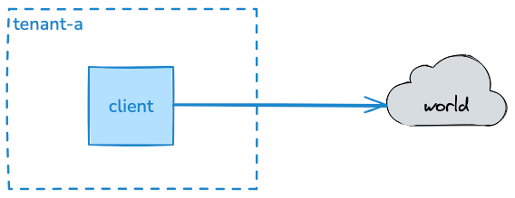
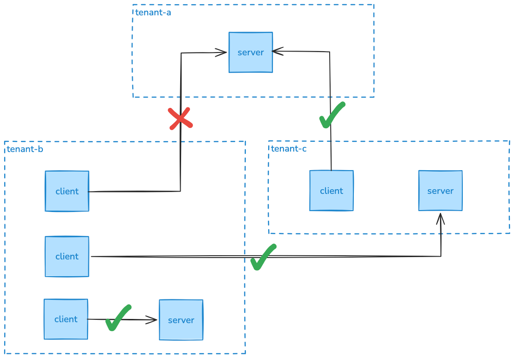

# Kind-Cilium

This repository contains a basic setup for playing around with Cilium in a kind cluster.

## Why

There's a lot of buzz around service meshes, eBPF, security and networking in Kubernetes. In order to gauge the maturity
of the Kubernetes ecosystem in this area, I wanted to play around with Cilium.

Most of the projects I've done with Kubernetes in the past have been focussing on security outside the cluster.
This was done with traditional (less cloud-native solutions) north-south traffic firewalls (Ingress and Egress).
Most of the time this was set up by a cloud or networking team.

These days, there are ways to enhance the security within the cluster itself. eBPF is being portrayed as a game-changer
for this, making Cilium an interesting project to look at.

### Cilium features this setup focuses on:

- CiliumNetworkPolicies: Cilium's implementation of Kubernetes NetworkPolicies with some extra features like L7 policies and DNS policies.
- Mutual Authentication: Cilium can encrypt traffic between pods and enforce mTLS (still beta at the time of writing).
- Traffic visibility: Cilium provides detailed visibility into the traffic between pods, which can be useful for debugging and monitoring.
- Service Mesh: Cilium has a built-in service mesh that can be used to manage traffic between services in the cluster.

### Other Cilium features that are not covered in this setup:

- Gateway API: Cilium has support for the Gateway API.
- Cilium Mesh: Cilium has a cluster mesh feature that allows you to connect multiple clusters together.
- Egress Gateway: Cilium has an egress gateway feature that allows you to route egress traffic through a specific set of pods.
- BGP: Cilium has support for BGP, which allows you to advertise pod IPs to your network using Layer 2 announcements.

## Getting Started

The repo contains everything you need to get started with Cilium in a kind cluster.
Basically, this was taken from the Cilium documentation and is a combination of these pages:

- https://docs.cilium.io/en/stable/gettingstarted/k8s-install-default/
- https://docs.cilium.io/en/stable/installation/k8s-install-helm/
- https://docs.cilium.io/en/stable/network/servicemesh/mutual-authentication/mutual-authentication/

Network policies were generated with the help of the [Cilium Network Policy Editor](https://editor.networkpolicy.io)

### Setup

```bash
./bootstrap/create-cluster.sh
```

This script does the following:

- Create a kind cluster
  - One control-plane, three worker nodes
- Deploys Cilium as the CNI via a Helm upgrade
  - Removes kube-proxy and replaces it with Cilium's eBPF-based networking
- Deploys Flux operator and bootstraps it to reconcile this repository
  - Using a repository structure inspired by the [FluxCD documentation](https://fluxcd.io/flux/guides/repository-structure/)
  - Entrypoint for all the FluxCD Kustomizations is `.flux/clusters/local`
- Builds and pushes a `client` and `server` image to the kind registry
- The FluxCD Kustomizations deploy a couple of workloads to test with:
  - A simple Layer 7 policy example with a `client` deployment that does a http request to google.com
  - A multi-namespace cluster mesh example with multiple `client` and `server` deployments that 
do http requests to each other

Hubble UI is deployed as part of the Cilium installation, and can be accessed via port forwarding:

```bashbash
kubectl port-forward -n kube-system svc/hubble-ui 8081:80
```

Visit http://localhost:8081 to access the Hubble UI.

### Cleanup
```bash
kind delete cluster --name local
```

## Scenario 1: Layer 7 Policy



In this scenario, we have a `client` deployment that does an https request to google.com. We want to allow this traffic, but only to google.com and not to any other external service.
A side effect of adding a policy is that once you add a policy to a namespace, all traffic that is not explicitly allowed by the policy will be blocked. 
This means that we need to allow all the network connections that are required for `client` to function properly.

Here's a list of what we need:

- Allow `client` to do DNS using `coredns` (UDP port 53)
- Allow `client` to do HTTPS to google.com (TCP port 443)
- Allow `client` to do HTTPS to www.google.com (TCP port 443)

The policy that allows this looks like this:

```yaml
apiVersion: cilium.io/v2
kind: CiliumNetworkPolicy
metadata:
  name: restrict-egress
spec:
  endpointSelector: {}
  egress:
    - toEndpoints:
        - matchLabels:
            io.kubernetes.pod.namespace: kube-system
            k8s-app: kube-dns
      toPorts:
        - ports:
            - port: "53"
              protocol: UDP
          rules:
            dns:
              - matchPattern: "*"
    - toFQDNs:
        - matchName: google.com
        - matchName: www.google.com
      toPorts:
        - ports:
            - port: "443"
```

This policy consists of two rules:
- The first rule allows any pod in the namespace to do DNS to `coredns` by allowing UDP traffic on port 53 to any endpoint that has the labels `io.kubernetes.pod.namespace: kube-system` and `k8s-app: kube-dns`.
The `k8s-app: kube-dns` label is added by the Coredns deployment, and the `io.kubernetes.pod.namespace: kube-system` label is a well-known label that Cilium knows as part of the `CiliumNetworkPolicy` DSL.
- The second rule allows any pod in the namespace to do HTTPS to google.com and www.google.com by allowing TCP traffic on port 443 to any FQDN that matches `google.com` or `www.google.com`.

## Scenario 2: Inter-cluster traffic and Mutual Authentication



In this scenario, we have multiple namespaces with `client` and `server` deployments that do http requests to each other.

There's 4 cases:

- `client-tenant-b` in namespace `tenant-b` doing a request to `server` in namespace `tenant-b` (intra-namespace, should be ALLOWED)
- `client-tenant-c` in namespace `tenant-b` doing a request to `server` in namespace `tenant-c` (inter-namespace, should be ALLOWED)
- `client-tenant-a` in namespace `tenant-c` doing a request to `server` in namespace `tenant-a` (inter-namespace, should be ALLOWED)
- `client-tenant-a` in namespace `tenant-b` doing a request to `server` in namespace `tenant-a` (inter-namespace, should be DROPPED)

We want these connections to use mutual TLS authentication, which means that both the client and the server need to present a valid certificate to each other in order for the connection to be established.

The policies that allow this can be found here:

- [./flux/workloads/tenant-a/policies.yaml](./flux/workloads/tenant-a/policies.yaml)
- [./flux/workloads/tenant-b/policies.yaml](./flux/workloads/tenant-b/policies.yaml)
- [./flux/workloads/tenant-c/policies.yaml](./flux/workloads/tenant-c/policies.yaml)

Not this policy rule:

```yaml
authentication:
  mode: required
```

This is all that is required to enable mTLS in Cilium (once you've set up SPIFFE using SPIRE, which is done in the helm values found here: [./flux/infrastructure/cilium/helm.yaml](./flux/infrastructure/cilium/helm.yaml)).
